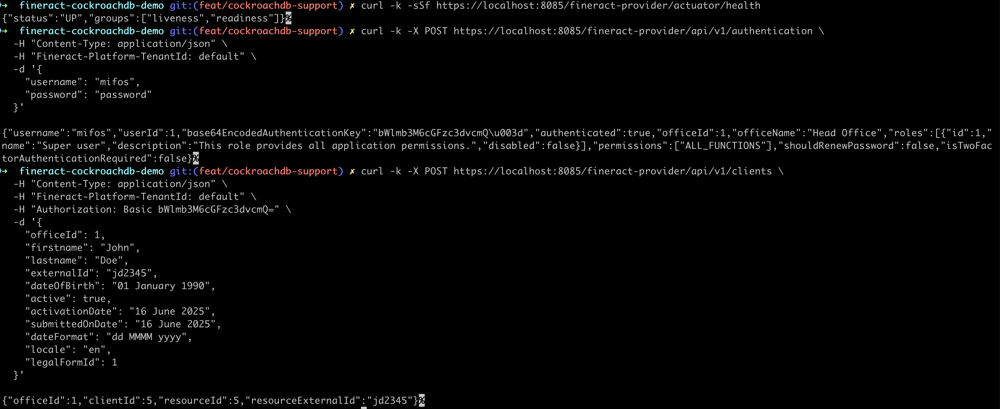

## 🪛 Working Apache Fineract + CockroachDB Demo (With Workaround)

This demo runs Apache Fineract using CockroachDB in PostgreSQL compatibility mode. It uses a prebuilt Docker image with patched Liquibase changelogs to avoid incompatible `ALTER` statements.

> ✅ This is a **working demo** that bypasses known schema incompatibilities. Authentication and tenant provisioning succeed. However, full functionality is **not yet fully validated**.

### 🐳 Quickstart

```bash
git clone https://github.com/viragtripathi/cockroach-collections.git
cd cockroach-collections/scripts/fineract-cockroachdb-demo

# Start the demo (requires Docker or Podman)
./run-demo.sh
```

Wait for the startup to complete. You can then test health and login APIs.

### ✅ Verifying the Demo

```bash
curl -k https://localhost:8085/fineract-provider/actuator/health
# {"status":"UP","groups":["liveness","readiness"]}

curl -k -X POST https://localhost:8085/fineract-provider/api/v1/authentication \
  -H "Content-Type: application/json" \
  -H "Fineract-Platform-TenantId: default" \
  -d '{
    "username": "mifos",
    "password": "password"
  }'
```

Expected output:

```json
{
  "username": "mifos",
  "authenticated": true,
  "roles": ["..."],
  "...": "..."
}
```

### 📄 init-tenant.sql

This SQL is executed post-startup to update existing rows instead of creating tables:

```sql
-- Safe to run on startup
CREATE DATABASE IF NOT EXISTS fineract_tenants;
CREATE DATABASE IF NOT EXISTS fineract_default;

UPDATE tenant_server_connections
SET
  schema_server = 'cockroachdb',
  schema_server_port = '26257',
  schema_username = 'root',
  schema_password = '',
  schema_connection_parameters = '',
  readonly_schema_server = '',
  readonly_schema_server_port = '',
  readonly_schema_username = '',
  readonly_schema_password = '',
  readonly_schema_connection_parameters = ''
WHERE id = 1;

UPDATE tenants
SET
  name = 'fineract_default',
  identifier = 'default',
  timezone_id = 'Asia/Kolkata',
  created_date = current_timestamp,
  lastmodified_date = current_timestamp,
  oltp_id = 1
WHERE id = 1;
```

### 🛠️ Docker Image Used

* Prebuilt Docker image: [`virag/fineract-cockroachdb-demo`](https://hub.docker.com/r/virag/fineract-cockroachdb-demo)
* Network: `fineract-crdb-net`

### 🏁 What Works

* Liquibase migrations for `fineract_tenants` and `fineract_default`
* Manual tenant schema re-pointing to CockroachDB
* Login and healthcheck APIs

## ✅ Working Demo Screenshots

### 🐚 Container Logs on Successful Startup


---

#### 🔐 Login & Client Creation API


---

### 📘 Swagger UI Loaded from Running Fineract Instance


### ⚠️ Known Gaps

* Not all Liquibase changelog operations (like `ALTER`) are supported by CockroachDB
* Long-term CockroachDB support in Apache Fineract will require upstream PRs and schema compatibility work

## 🔗 References

* [Apache Fineract](https://github.com/apache/fineract)
* [CockroachDB Docs - PostgreSQL Compatibility](https://www.cockroachlabs.com/docs/stable/postgresql-compatibility.html)
